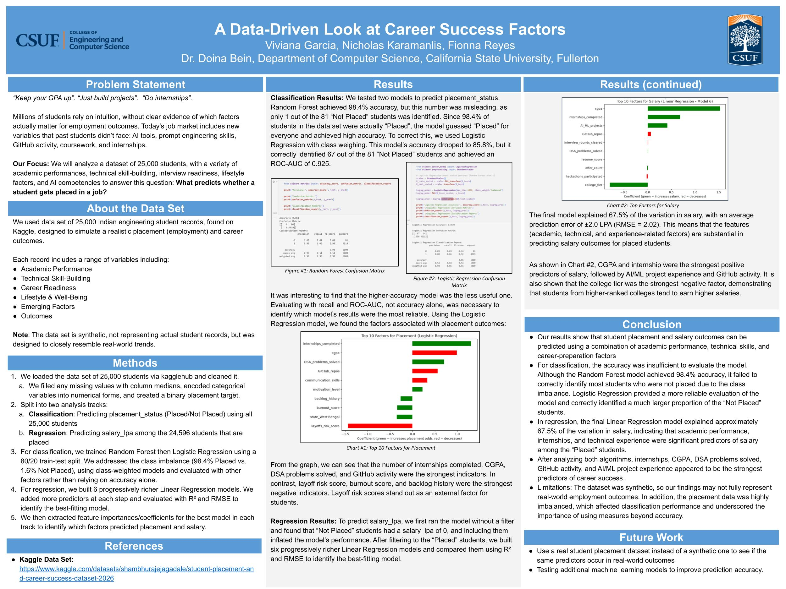

# A-Data-Driven-Look-at-Career-Success-Factors

Machine learning analysis of 25,000 student records to identify the strongest predictors of job placement and salary outcomes. Presented at the 2026 CSUF Summer Symposium (Poster 166A), through the Summer Undergraduate Research Academy (SUReA) under faculty mentor Dr. Doina Bein.

## 🎯 Project Overview

Students are constantly told to "keep your GPA up," "build projects," and "do internships" — but this advice is rarely tested against real data. This project uses machine learning to answer two questions:

1. **Classification:** What predicts whether a student gets placed in a job?
2. **Regression:** Among placed students, what predicts their salary?

## 📊 Dataset

- **Source:** [Student Placement & Career Success Dataset 2026](https://www.kaggle.com/datasets/shambhurajejagadale/student-placement-and-career-success-dataset-2026) (Kaggle)
- **Size:** 25,000 synthetic student records, 44 features
- **Note:** Synthetic data, designed to closely resemble real-world placement trends

Features span academic performance (CGPA, backlogs), technical skill-building (DSA problems, GitHub activity, hackathons), career readiness (internships, resume score, interview performance), lifestyle/wellbeing (sleep, stress, burnout), and emerging factors (AI tool usage, prompt engineering skill).

## 🛠️ Methods

1. **Data Cleaning:** Filled missing values with column medians, one-hot encoded categorical variables, created a binary placement target
2. **Classification:** Trained Random Forest and Logistic Regression to predict `placement_status`, using an 80/20 train-test split
3. **Regression:** Built 6 progressively richer Linear Regression models to predict `salary_lpa` among placed students, evaluated with R² and RMSE
4. **Feature Importance:** Extracted and visualized top predictors from the best-performing model in each track

## 🔑 Key Findings

- **Class imbalance mattered more than expected:** The dataset was 98.4% Placed vs. 1.6% Not Placed. Our first model (Random Forest) achieved 98.4% accuracy but correctly identified only 1 of 81 Not-Placed students in the test set — it had essentially learned to guess "Placed" for everyone.
- **Switching models fixed it:** Logistic Regression with class weighting traded some accuracy (85.8%) for real predictive power, correctly identifying 67 of 81 Not-Placed students (ROC-AUC = 0.925).
- **Caught a data leakage issue in the regression pipeline:** An early version of the salary model included non-placed students (whose salary was recorded as 0), inflating results. After filtering to placed students only, R² improved from 0.606 to **0.675** (RMSE ≈ 2.02 LPA).
- **Strongest predictors across both models:** `internships_completed` and `cgpa` were the most consistent predictors of both placement and salary. Technical activity (`DSA_problems_solved`, `GitHub_repos`) mattered more for placement; `AI_ML_projects` and `college_tier` mattered more for salary specifically.
